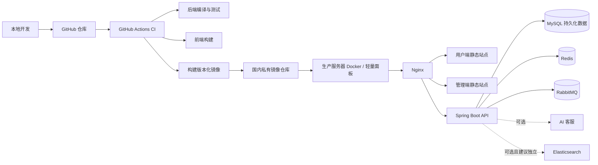

# 末路衣橱生产上线与 GitHub CI/CD 主计划（第一版）

> 状态：基础 GitHub 协作与 CI 已实施；镜像发布、CD 和生产上线仍待规划
>
> 创建日期：2026-07-22
>
> 最近更新：2026-08-28（PR #2 完成首轮远程 CI 验证）
>
> 适用范围：`Final-StandMarket`（Spring Boot、Vue 用户端、Vue 管理端、Redis、RabbitMQ、MySQL，以及可选的 AI 客服与 Elasticsearch）
>
> 本文是上线前的总方案。后续每个实施阶段必须另建阶段 MD，明确代码文件、配置文件、验证方式和审查报告后，才开始改动。

---

## 1. 上线目标与基本结论

### 1.1 目标

建立一套可重复、可回滚、可追踪的生产发布流程：

```text
本地开发与自测
  ↓
推送 GitHub 仓库（当前远程仓库为 public，禁止提交任何秘密）
  ↓
GitHub Actions 执行测试、构建并制作 Docker 镜像（CI）
  ↓
推送国内私有镜像仓库
  ↓
生产服务器拉取指定版本镜像并完成部署（CD）
  ↓
健康检查、日志检查、业务冒烟验证
```

### 1.2 核心原则

1. **代码、构建产物、运行配置、业务数据分离。**
   - GitHub 保存代码和非敏感部署模板；
   - 镜像仓库存放可运行镜像；
   - 服务器保存生产密钥和环境变量；
   - MySQL 保存生产业务数据，不被本地数据覆盖。
2. **镜像必须使用不可变版本标签，不能只依赖 `latest`。**
3. **数据库结构变更采用“版本化迁移”，不是每次用完整 SQL 覆盖数据库。**
4. **生产发布先可控、后自动化。** 第一版保留人工确认与回滚能力，不直接做每次提交自动覆盖生产环境。
5. **4 GB 内存优先保证交易核心链路。** 前端、后端、MySQL、Redis、RabbitMQ 优先；Elasticsearch 与 AI 客服按资源情况延后或拆分。

---

## 2. 当前项目与上线边界

### 2.1 当前应用组成

| 组件 | 项目位置 | 生产定位 | 第一版建议 |
|---|---|---|---|
| Java 后端 | `backend/fashion-server` | 核心 API、订单、秒杀业务 | 必须部署 |
| 用户端 Vue | `frontend/fashion-client` | 用户访问页面 | 必须部署 |
| 管理端 Vue | `frontend/fashion-admin` | 商家/管理员后台 | 必须部署，建议限制访问 |
| MySQL 8 | 外部服务或容器 | 核心业务数据 | 必须部署并持久化、备份 |
| Redis 7 | 已部署在目标服务器，通过本地隧道供开发机访问 | 缓存、分布式锁、秒杀预扣 | 作为既有服务器依赖接入；生产应用直接走服务器内网/本机地址，不再走开发隧道 |
| RabbitMQ | 已部署在目标服务器，通过本地隧道供开发机访问 | 异步下单、延迟/死信处理 | 作为既有服务器依赖接入；生产应用直接走服务器内网/本机地址，不再走开发隧道 |
| Nginx | 服务器容器或宿主机 | HTTPS、静态资源、反向代理 | 必须部署 |
| AI 客服 | `agent-service` | 可选增强服务 | 资源允许后部署 |
| Elasticsearch + Kibana | 已部署在目标服务器，通过本地隧道供开发机访问 | 商品搜索增强 | 不在本次应用 compose 中重复创建；需先确认现有服务资源与访问方式 |

### 2.1.1 已确认：服务器既有中间件与本地隧道

截至 **2026-07-22**，Redis、RabbitMQ、Elasticsearch 已经运行在计划部署应用的同一台服务器上；本地开发机目前通过本地隧道连接这些服务。

这意味着需要明确区分两种运行路径：

```text
本地开发：本地应用 → 本地隧道端口（通常是 localhost） → 服务器 Redis / RabbitMQ / Elasticsearch
生产部署：服务器上的应用容器 → 服务器内网、本机端口或既有 Docker 网络 → Redis / RabbitMQ / Elasticsearch
```

**生产容器不能继续使用开发机上的本地隧道地址。** 容器中的 `localhost` 指向容器自身，而不是宿主机、更不是开发电脑。应用部署到服务器后，应直接连接服务器上的中间件，并由部署方式决定服务地址：

| 既有中间件的运行方式 | 生产应用应采用的连接方式 | 不应采用的方式 |
|---|---|---|
| 中间件已由 Docker/面板容器运行，且可加入同一 Docker 网络 | 使用既有 Docker 网络与服务名/容器别名 | 依赖开发机隧道、映射公网端口 |
| 中间件安装在服务器宿主机 | 通过受限宿主机地址或 Docker host-gateway 映射访问；端口仅绑定服务器本机/内网 | 容器内写 `localhost`、将端口暴露公网 |
| 中间件由其他内网机器/受管服务提供 | 使用内网 DNS/IP 与最小权限账号 | 使用公网明文连接或开发隧道 |

在开始实际容器编排前，必须确认 Redis、RabbitMQ、Elasticsearch 当前分别是“宿主机服务”还是“已有容器服务”、监听端口、Docker 网络、认证方式以及数据持久化位置。该确认属于阶段 0 的服务器资源清单补充，不改变本阶段“不自动覆盖中间件”的原则。

---
### 2.2 不纳入本次第一版自动发布的内容

下列内容不应因普通代码提交而被自动覆盖或自动删除：

- 生产 MySQL 的用户、订单、支付、库存、秒杀订单、地址等业务数据；
- Redis 的运行时缓存和秒杀状态；
- RabbitMQ 尚未消费的消息与队列状态；
- OSS、支付平台、JWT、数据库、Redis、RabbitMQ 的账号密码和密钥；
- MySQL、Redis、RabbitMQ 的 Docker 数据卷；
- Elasticsearch 历史索引数据。

---

## 3. 推荐目标架构



### 3.1 镜像与配置分工

| 类别 | 应包含内容 | 不应包含内容 |
|---|---|---|
| 后端镜像 | JAR、启动脚本、非敏感默认配置 | 数据库密码、OSS 密钥、支付私钥、生产配置文件 |
| 前端镜像 | 已构建的静态资源、Nginx 配置模板 | 管理员账号、私有 API 密钥 |
| 服务器环境文件 | 数据库/中间件地址、密码、域名、回调地址、密钥 | 不提交 GitHub，不打入镜像 |
| 数据卷 | MySQL、Redis、RabbitMQ、必要时 ES 数据 | 不随应用镜像重建或删除 |

### 3.2 生产环境建议目录（服务器侧）

以下是目标约定，后续实施时可以根据面板实际目录调整：

```text
/opt/fashion-shop/
├─ compose/                 # docker-compose 及部署脚本
├─ config/                  # 仅服务器保存的生产配置、证书引用等
├─ data/                    # MySQL / Redis / RabbitMQ 等持久化数据
├─ backups/                 # 本机短期备份缓存
├─ logs/                    # 应用和部署日志
└─ releases/                # 版本、回滚记录（可选）
```

> 生产配置目录与数据目录必须限制权限；不可映射到 Web 可访问目录。

---

## 4. CI/CD 发布策略

### 4.1 分支和环境策略

| Git 分支/事件 | 动作 | 部署环境 |
|---|---|---|
| `feature/*` 或普通 Pull Request | 编译、单元测试、前端构建检查 | 不部署 |
| `develop`（如后续启用） | 构建镜像，可选推送测试标签 | 测试环境 |
| `main` / `master` | 构建生产候选镜像，不直接覆盖线上 | 生产候选 |
| 创建版本标签，例如 `v1.0.0` | 构建、推送、人工确认后部署 | 生产环境 |

**第一版建议：仅通过 Git 标签触发生产部署。**

这样可避免“某次直接 push 到主分支后，线上立即自动更新”的风险。

### 4.2 CI 应执行的检查

2026-08-28 已先交付不接触生产凭据的基础质量门禁：Java 测试、两个前端生产构建、Python 测试和 Gitleaks。下列镜像构建、推送和发布摘要仍属于后续独立 workpack，不得把“基础 CI 已启用”误写为“生产 CI/CD 已完成”。

完整发布工作流后续应包括：

1. 拉取指定提交的代码；
2. 后端执行 Maven 编译与测试；
3. 用户端与管理端安装依赖并执行生产构建；
4. 构建后端、用户端、管理端镜像；
5. 为镜像生成可追踪标签；
6. 推送至国内**私有**镜像仓库；
7. 保存构建摘要，包括提交号、镜像地址、镜像标签、构建时间。

后续可增加：依赖漏洞扫描、镜像扫描、前端 lint、接口测试、制品签名。

### 4.3 版本标签规范

每次生产候选版本至少使用以下标签之一：

```text
<仓库>/fashion-server:v1.0.0
<仓库>/fashion-client:v1.0.0
<仓库>/fashion-admin:v1.0.0
```

建议同时推送可追溯提交标签：

```text
<仓库>/fashion-server:sha-<短提交号>
<仓库>/fashion-client:sha-<短提交号>
<仓库>/fashion-admin:sha-<短提交号>
```

`latest` 可以保留给“最近一次成功构建”，但**生产部署、回滚和问题定位均以版本号或提交号标签为准**。

### 4.4 CD 的第一版方式

有两种可选做法，第一版优先采用 A：

| 方式 | 说明 | 建议 |
|---|---|---|
| A. 面板人工点击拉取/更新 | CI 推送镜像后，管理员在服务器面板选择指定版本并重启 | **第一版推荐**：风险可控、实现简单 |
| B. GitHub Actions 调服务器部署接口/SSH | CI 完成后自动触发服务器拉镜像、迁移、重启 | 第二阶段再做：需要更严格的权限、回滚和健康检查 |
| C. 服务器轮询镜像更新 | 服务器定时发现新镜像后自动更新 | 不推荐作为生产第一版：可能在不合适的时间发布 |

无论使用哪种方式，部署顺序均应为：

```text
选择目标镜像版本
  ↓
确认备份成功且数据库迁移脚本已审查
  ↓
拉取镜像
  ↓
执行数据库迁移
  ↓
启动/更新应用
  ↓
等待健康检查成功
  ↓
Nginx 切流或重载
  ↓
接口、登录、下单等冒烟验证
```

---

## 5. 数据库：可以迁移，不能直接“同步覆盖”

### 5.1 三类数据库内容的处理规则

| 内容 | 是否随发布执行 | 正确方式 |
|---|---:|---|
| 表、字段、索引、约束等结构变更 | 是 | 使用 Flyway 或 Liquibase 的版本化迁移脚本 |
| 必要的字典、角色、初始分类等基础数据 | 谨慎执行 | 幂等 SQL，且明确哪些环境可执行 |
| 用户、订单、支付、库存、秒杀订单等生产数据 | 否 | 仅在生产库持续累积，依靠备份、恢复和对账保护 |

### 5.2 为什么不能全量同步本地数据库

生产库上线后会持续产生真实业务数据。将本地数据库导出后覆盖服务器，可能导致：

- 删除用户、订单、支付、售后、地址等真实数据；
- 覆盖库存、优惠券、秒杀活动状态；
- 破坏外部支付回调、RabbitMQ 消息处理和 Redis 预扣库存之间的一致性；
- 将测试账号、测试订单、测试图片带入生产环境；
- 因误操作导致不可逆的数据丢失。

**结论：本地 SQL 全量导入只适用于首次初始化空环境；生产环境后续只做受控的增量迁移。**

### 5.3 建议采用 Flyway

当前后端是 Spring Boot 2.7 + Maven，建议将数据库迁移纳入后端工程。目标目录：

```text
backend/fashion-server/src/main/resources/db/migration/
├─ V001__baseline_existing_schema.sql
├─ V002__add_xxx_column.sql
├─ V003__create_xxx_table.sql
└─ V004__add_xxx_index.sql
```

迁移规则：

1. 一个已发布的迁移文件不得修改、重命名或删除；
2. 每次结构变更新增一个更高版本号 SQL 文件；
3. 每条迁移在测试环境先执行并验证；
4. 生产迁移前必须有数据库备份；
5. 高风险迁移（删列、改类型、大表重建、批量更新）不与常规自动发布绑定，必须单独评审；
6. 数据库账号按最小权限拆分：应用账号不应拥有随意删库权限；迁移账号可单独配置。

### 5.4 兼容性发布原则

针对订单、商品、秒杀等线上表，采用“先扩展、再切换、后清理”的方式：

```text
第 1 次发布：新增字段/新表/新索引，保留旧逻辑
第 2 次发布：应用同时兼容新旧字段，逐步切换读写
第 3 次发布：确认稳定、历史数据处理完成后，单独清理旧字段/旧逻辑
```

禁止在没有备份和验证的情况下，随普通发布执行：

```sql
DROP TABLE ...;
DROP COLUMN ...;
TRUNCATE TABLE ...;
UPDATE ...; -- 无明确范围
```

### 5.5 首次初始化与本地数据导入

首次生产部署若需要导入初始数据，应分为两份脚本：

```text
mysql/
├─ schema/        # 仅结构与必要索引
└─ seed/          # 可审查的基础数据，不含测试订单和敏感数据
```

现有全量 SQL 文件仅作为开发/测试初始化来源；在导入生产前必须人工审查与清理。

---

## 6. 数据备份、恢复与对账

### 6.1 MySQL 是最高优先级

生产 MySQL 至少满足：

- 每日全量备份；
- 开启 binary log，支持恢复到备份后的某个时间点；
- 备份上传到异机或对象存储，不能只留在同一台服务器；
- 保留周期、备份命名、执行时间可追踪；
- 至少每月进行一次“从备份实际恢复”的演练；
- 上线前、数据库迁移前必须创建额外备份。

最低可行的恢复链路：

```text
最近一次全量备份
  + 该时间点之后的 binary log
  → 恢复到故障/误操作前的指定时间
```

### 6.2 Redis、RabbitMQ 的保护

| 组件 | 风险 | 第一版要求 |
|---|---|---|
| Redis | 重启或内存淘汰后丢失缓存、秒杀预扣状态 | 配置持久化策略；关键库存可从数据库/活动信息重新预热；设 `maxmemory` 与淘汰策略 |
| RabbitMQ | 消息未持久化或消费失败导致订单丢失/重复 | 队列和消息持久化、消费者手动 ACK、失败重试、死信队列、幂等消费 |

### 6.3 秒杀链路的专项风险

当前关键链路为：

```text
Redis + Lua 预减库存 → RabbitMQ 异步下单 → MySQL 落单
```

必须在上线前核实：

1. Redis 预扣成功、数据库落单失败时的补偿或对账方案；
2. 消息重复投递时的幂等处理；
3. 同一用户同一活动的数据库唯一约束；
4. RabbitMQ 消费失败后是否进入重试/死信队列；
5. Redis 缓存重建时的库存预热流程；
6. 订单超时取消释放库存的链路是否可观测、可重试；
7. 发布或重启期间是否避免中断关键消费者。

---

## 7. 安全与敏感配置

### 7.1 已确认的重点风险

后端配置使用环境占位符加载数据源、Redis、RabbitMQ、OSS、支付等配置；这是正确方向。

但当前默认配置中仍存在固定 JWT 签名密钥，生产环境必须替换为强随机密钥并从服务器安全配置中注入，不能沿用示例值。

### 7.2 配置存放规则

| 位置 | 允许存放 | 禁止存放 |
|---|---|---|
| Git 仓库 | 配置模板、变量名称、示例值 | 真实密码、私钥、Token、证书 |
| GitHub Actions Secrets | 镜像仓库推送凭据等 CI 所需短期/最小权限凭据 | 业务数据库全量备份、长期生产管理员密码（除非确有必要） |
| 生产服务器 `config/` 或 `.env` | 生产运行所需真实密钥 | Web 可访问文件、镜像层 |
| Docker 镜像 | 应用程序与非敏感默认配置 | 所有真实生产密钥 |

需要保护的敏感项包括：

- MySQL、Redis、RabbitMQ 密码；
- OSS `access-key-id` 与 `access-key-secret`；
- 支付宝/微信支付私钥、API 密钥、商户证书；
- JWT 管理端、用户端签名密钥；
- 镜像仓库的推送/拉取 Token；
- 域名证书私钥。

### 7.3 密钥治理要求

1. CI 推送镜像和服务器拉取镜像使用不同账号/Token；
2. CI 账号只有推送目标命名空间的权限；服务器账号只有拉取权限；
3. 定期轮换 Token，人员变动时立即废止；
4. Action 日志、容器日志不得输出密钥或完整配置；
5. 管理端必须限制访问来源、启用强密码，并尽量避免直接暴露后台端口；
6. MySQL、Redis、RabbitMQ 管理端口不得直接对公网开放。

---

## 8. 4 GB 服务器资源规划

### 8.1 风险判断

4 GB 内存服务器当前已运行 Redis、RabbitMQ、Elasticsearch；若再加入 Java、MySQL、Nginx、用户端、管理端及可能的 AI 客服，发生内存耗尽、频繁重启或请求超时的风险很高。

Elasticsearch 已经占用该服务器资源，因此第一版应用部署不能再重复创建 ES/Kibana 容器；仍需评估现有 ES 的 JVM 配额、索引规模和剩余内存。

### 8.2 第一版推荐部署组合

| 服务 | 第一版 | 备注 |
|---|---:|---|
| Nginx | 启用 | 静态资源与反向代理占用较低 |
| 用户端 / 管理端 | 启用 | 优先构建为静态文件由 Nginx 提供 |
| Spring Boot | 启用 | 为 JVM 设置明确内存上限 |
| MySQL | 启用，但优先考虑云数据库 | 若本机部署，必须限资源并加强备份 |
| Redis | 复用既有服务 | 不在应用 compose 中创建；核实持久化、内存上限、认证和生产连接地址 |
| RabbitMQ | 复用既有服务 | 不在应用 compose 中创建；核实消息持久化、认证、队列积压和生产连接地址 |
| AI 客服 | 暂缓或按需启用 | 可先外部化/独立服务 |
| Elasticsearch + Kibana | 复用既有服务，不新增容器 | 核实当前实例资源；应用 ES 功能可按需连接，Kibana 管理端不对公网开放 |

### 8.3 资源与稳定性控制项

后续 compose 文件应为服务设置：

- 内存上限或 JVM `-Xms/-Xmx`；
- `restart: unless-stopped` 等可控重启策略；
- 健康检查；
- 日志滚动，防止磁盘被容器日志写满；
- 数据卷明确映射到宿主机持久目录；
- 非必要端口不映射到公网。

> 第一版建议先将服务器升级到至少 4 核 8 GB，或把 MySQL/Elasticsearch 拆到独立资源。若仍使用 4 GB，必须先完成压测和内存观察，再决定是否启用 AI/ES。

---

## 9. 发布、验证与回滚

### 9.1 每次生产发布前检查清单

- [ ] Git tag / 镜像版本号明确；
- [ ] GitHub Actions 构建、测试、镜像推送成功；
- [ ] 目标镜像为私有仓库中的指定版本，不以 `latest` 作为唯一依据；
- [ ] 本次是否有数据库迁移，迁移 SQL 已审查；
- [ ] MySQL 备份已成功且可定位；
- [ ] 生产配置、域名、回调地址、密钥均已核对；
- [ ] 当前旧镜像版本已记录，确认可回滚；
- [ ] Redis、RabbitMQ 没有需要人工处置的异常积压；
- [ ] 服务器可用内存、磁盘空间、日志容量满足要求。

### 9.2 发布后冒烟验证

- [ ] 用户端首页、商品列表、商品详情可访问；
- [ ] 用户登录、管理员登录正常；
- [ ] 商品图片/OSS 资源正常加载；
- [ ] 购物车、下单、订单查询正常；
- [ ] 支付回调地址与订单状态流转正常（按测试环境或沙箱验证）；
- [ ] 秒杀活动查询与下单链路正常；
- [ ] 后端健康检查通过；
- [ ] Redis、RabbitMQ、MySQL 连接正常；
- [ ] 错误日志中没有持续异常；
- [ ] 管理端功能与 API 权限无异常。

### 9.3 回滚原则

1. **应用问题**：先回滚应用镜像到上一个已验证版本；
2. **数据库问题**：不能简单回滚镜像就认为完成，必须依据迁移影响评估是否需要恢复数据；
3. **数据库迁移不可逆时**：应用代码必须在迁移前后保持兼容，避免紧急回滚时无法连接新表结构；
4. **发生数据误删或错误批量更新**：停止进一步写入，按备份 + binary log 制定恢复方案；
5. **禁止为回滚而删除 Docker 数据卷。**

第一版回滚的目标是：

```text
记录当前版本 → 发现异常 → 选择上一稳定版本镜像 → 重新部署 → 健康检查 → 业务验证
```

---

## 10. 实施阶段拆分（后续讨论后建立阶段文档）

| 阶段 | 目标 | 主要产物 | 状态 |
|---|---|---|---|
| 阶段 0 | 确认服务器、域名、镜像仓库和资源边界 | 资源清单、部署决策 | 待讨论 |
| 阶段 1 | 容器化核心应用 | 后端/前端 Dockerfile、生产 compose 模板 | 待规划 |
| 阶段 2 | 生产配置与安全治理 | 配置模板、服务器 `.env` 约定、密钥清单 | 待规划 |
| 阶段 3 | 数据库迁移与备份 | Flyway 接入、备份脚本、恢复演练记录 | 待规划 |
| 阶段 4 | GitHub Actions CI | 基础测试/构建/敏感扫描已启用；镜像构建与国内仓库推送待后续 workpack | 部分完成 |
| 阶段 5 | 人工确认式 CD | 面板/服务器部署脚本、版本与回滚记录 | 待规划 |
| 阶段 6 | 监控、告警与自动化 CD | 健康检查、日志策略、可选自动触发部署 | 待规划 |
| 阶段 7 | AI 客服与 ES 独立部署评估 | 资源评估、独立部署方案 | 待规划 |

### 阶段 0 需要先确认的事项

1. 服务器实际配置：CPU、内存、磁盘、系统版本、带宽、是否已有 Docker/面板；同时记录 Redis、RabbitMQ、Elasticsearch 的进程/容器、端口、网络、认证、数据目录和当前内存占用；
2. 是否已有域名、是否备案、是否需要 HTTPS；
3. 打算使用哪一家国内镜像仓库；
4. MySQL 是同机 Docker、宿主机安装，还是云数据库；
5. 首次是否需要导入现有本地数据，以及哪些数据允许进入生产；
6. 是否先部署 AI 客服和 Elasticsearch；
7. 生产发布是否坚持“Git tag + 人工确认”，还是未来需要全自动发布。

---

## 11. 当前已识别风险汇总

| 风险 | 后果 | 第一版控制措施 |
|---|---|---|
| `latest` 覆盖部署 | 无法准确回滚、版本不清 | 使用 Git tag 与 SHA 镜像标签 |
| 本地 SQL 覆盖生产库 | 订单、用户、库存等数据丢失 | Flyway 增量迁移，不做全量同步 |
| 无异机备份 | 服务器故障时数据无法恢复 | 每日全量备份 + 对象存储 + binary log |
| 4 GB 内存承载既有中间件和新应用 | OOM、重启、超时 | 复用既有 Redis/RabbitMQ/ES，不重复创建；先盘点资源、限制 Java 内存，AI 延后或拆分 |
| 密钥进入 Git/镜像 | 云资源、支付、数据库被盗用 | Secrets + 服务器配置注入 + 最小权限 |
| 自动部署无验证 | 发布故障直接影响用户 | 生产先人工确认，部署后健康检查与冒烟验证 |
| 消息/库存状态不一致 | 超卖、漏单、重复单 | 持久化、幂等、死信、补偿和对账 |
| Docker 数据卷误删除 | MySQL/中间件数据丢失 | 明确持久化目录，禁止使用破坏性清理命令 |
| 管理端或中间件端口暴露公网 | 被扫描、暴力破解或数据泄露 | 防火墙白名单、反向代理、强认证、非公网端口 |

---

## 12. 本文结论

该方案可以作为项目的 CI/CD 主线，但第一版上线应采用以下边界：

```text
GitHub Actions：负责构建、测试、生成版本化镜像并推送私有仓库
服务器/轻量面板：在人工确认后拉取指定版本、执行受控迁移、重启并检查健康状态
数据库：只增量迁移结构，不用本地全量数据覆盖生产库
备份：生产 MySQL 必须在上线前建立异机备份与恢复能力
资源：4 GB 机器先保障交易核心服务，AI 客服与 Elasticsearch 不默认同机上线
```

下一步不直接写部署代码。应先完成“阶段 0：资源与部署边界确认”，再为阶段 1 创建详细实施文档。

