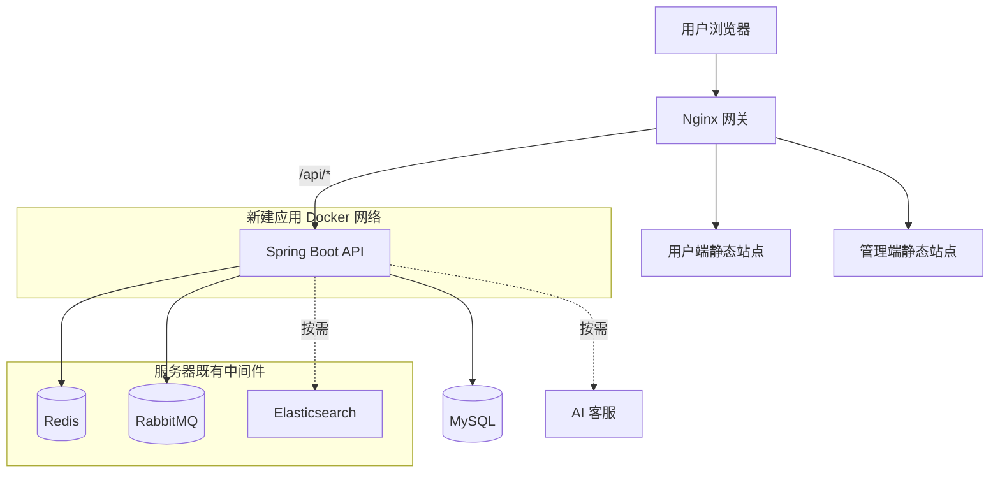

# 阶段 1-核心应用容器化

> 基于 [生产上线与GitHub-CICD主计划.md](生产上线与GitHub-CICD主计划.md) 的“阶段 1：容器化核心应用”。
>
> 状态：待讨论，尚未实施
>
> 创建日期：2026-07-22
>
> 前置阶段：[阶段0-目录结构整理.md](阶段0-目录结构整理.md) 已完成。

---

## 1. 阶段目标

为末路衣橱建立可以在测试环境和生产服务器重复运行的容器化交付基础：

1. 为 Java 后端、用户端 Vue、管理端 Vue 分别构建独立 Docker 镜像；
2. 使用 Nginx 对外提供用户端、管理端静态资源与 `/api` 反向代理；
3. 使用 Docker 内部网络连接新建应用服务；Redis、RabbitMQ、Elasticsearch 复用服务器既有实例，并按其实际运行方式接入；
4. 生产密钥、域名、数据库密码等通过服务器环境文件注入，不进入 Git、Dockerfile 或镜像；
5. 为 GitHub Actions 后续构建镜像和推送仓库提供稳定入口；
6. 第一版不新建 Redis、RabbitMQ、Elasticsearch/Kibana 容器：这些中间件已在目标服务器运行，本地开发机目前通过隧道访问；AI 客服也不强制放入 4 GB 服务器。

本阶段仅解决“应用如何被可靠打包与启动”，**不接入 GitHub Actions、不创建生产数据库、不执行数据迁移、不实际发布到服务器**。

---

## 2. 当前工程事实与影响

### 2.1 已确认的构建入口

| 应用 | 当前构建方式 | 容器化结论 |
|---|---|---|
| Java 后端 | 根目录 Maven 聚合构建；产物为 `backend/fashion-server/target/fashion-server-1.0-SNAPSHOT.jar` | 使用多阶段 Maven 构建镜像，运行期仅保留 JRE 与 JAR |
| 用户端 | `frontend/fashion-client` 执行 `npm run build` | 使用 Node 构建、Nginx 运行静态文件 |
| 管理端 | `frontend/fashion-admin` 执行 `npm run build` | 使用 Node 构建、Nginx 运行静态文件 |
| AI 客服 | 已有 `agent-service/Dockerfile` | 先保留，不纳入核心生产 compose；后续独立评估 |
| Elasticsearch | 已部署于目标服务器，本地开发通过隧道访问；仓库仍保留本地 ES Docker 配置 | 不纳入核心生产 compose，也不重复启动；先确认既有服务的网络与资源情况 |

### 2.2 已确认的配置风险（本阶段必须修复）

| 问题 | 当前状态 | 本阶段处理原则 |
|---|---|---|
| Spring 默认 profile | `application.yml` 固定 `active: dev` | 改为由环境变量决定，生产强制指定 `prod`，不能容器启动后仍读开发配置 |
| JWT 签名密钥 | `application.yml` 有示例固定值 | 改为环境变量占位符；生产值只在服务器私有配置中存在 |
| AI 服务地址 | `fashion.agent.url` 有 localhost 默认值；`AgentServiceImpl` 另有硬编码 `http://localhost:8000/chat` | 统一只从配置读取；若未来 AI 容器加入同一网络则用服务名，例如 `http://agent-service:8000` |
| Elasticsearch 地址 | 本地开发通过隧道地址连接，默认值为 `http://localhost:19200` | 改为配置化；生产容器根据既有 ES 的实际运行方式使用 Docker 网络服务名、宿主机网关或内网地址，绝不能复用开发隧道的 `localhost` 地址 |
| 跨域白名单 | 仅允许本地 Vite 地址 | 生产使用同源 `/api` 反向代理时通常不依赖跨域；仍应将允许来源配置化，便于未来独立域名部署 |
| 健康检查 | 未发现 Spring Actuator | 加入可供 Docker/Nginx/部署脚本使用的健康检查端点；不得以登录/业务接口作为存活探针 |
| 构建上下文 | 后端、前端目前无 `.dockerignore` | 新增忽略文件，防止把 `node_modules`、`target`、`.env`、本地 IDE 状态带入构建上下文 |

### 2.3 前端 API 路径结论

两个前端当前均使用：

```js
baseURL: '/api'
```

这是生产部署的优势。Nginx 可将：

```text
https://<用户域名>/api/**  →  http://fashion-server:8080/**
https://<管理域名>/api/**  →  http://fashion-server:8080/**
```

并在转发时去除 `/api` 前缀，使后端保持现有 `/user/**`、`/admin/**` 等路由。这样用户端、管理端和 API 可以保持同源，减少 CORS、Cookie、HTTPS 混用问题。

---

## 3. 第一版部署拓扑与边界



### 3.1 服务分层

| 层级 | 服务 | 第一版是否包含 | 外网暴露原则 |
|---|---|---:|---|
| 边缘层 | Nginx | 是 | 仅暴露 `80/443` |
| 应用层 | 用户端、管理端、Spring Boot | 是 | 用户端/管理端经 Nginx；后端不直接暴露公网 |
| 数据层 | MySQL、Redis、RabbitMQ | MySQL 待定；Redis/RabbitMQ 为既有服务 | Redis/RabbitMQ 不由本 compose 创建；连接仅走服务器本机、内网或既有 Docker 网络，管理端口不公开 |
| 可选增强层 | AI 客服、Elasticsearch、Kibana | AI 否；ES/Kibana 已存在 | 不新建 ES/Kibana；确认既有服务仅内网/受限访问 |

### 3.2 4 GB 服务器的首版资源预算（需压测后调整）

| 服务 | 建议初始限制 | 说明 |
|---|---:|---|
| Nginx | 64–128 MB | 静态资源与反向代理 |
| 用户端 Nginx | 32–64 MB | 可与网关复用，也可独立容器 |
| 管理端 Nginx | 32–64 MB | 管理端建议只允许受限入口访问 |
| Spring Boot | 768 MB–1 GB | 使用明确 JVM `-Xms/-Xmx`，后续按压测调整 |
| MySQL | 1–1.5 GB | 优先建议迁至云数据库；同机必须持久化与备份 |
| Redis（既有） | 256–384 MB（需实测） | 已占用服务器资源；核实现有 `maxmemory`、淘汰策略、持久化和剩余内存 |
| RabbitMQ（既有） | 384–512 MB（需实测） | 已占用服务器资源；核实现有内存水位线、持久化、队列堆积和剩余内存 |
| 预留给 OS/Docker | 至少 700 MB | 防止 OOM 和系统失去响应 |

> 上表总量非常紧张，且 Redis、RabbitMQ、Elasticsearch 已在服务器实际占用资源。因此 4 GB 同机部署只建议作为低流量演示/试运行方案。AI 客服不进入首版核心 compose；ES/Kibana 也不重复创建。条件允许时优先升级到 **4 核 8 GB** 或使用云数据库。

---

## 4. 目标文件结构

```text
Final-StandMarket/
├─ backend/
│  ├─ Dockerfile                         # 新增：后端多阶段构建镜像
│  ├─ .dockerignore                      # 新增：排除 target、IDE、敏感配置等
│  └─ fashion-server/
│     └─ src/main/resources/
│        ├─ application.yml              # 调整：环境变量与安全默认值
│        └─ application-prod.yml.example # 新增：仅变量模板，不含真实密钥
├─ frontend/
│  ├─ fashion-client/
│  │  ├─ Dockerfile                      # 新增：Node 构建 + Nginx 静态运行
│  │  └─ .dockerignore                   # 新增
│  └─ fashion-admin/
│     ├─ Dockerfile                      # 新增：Node 构建 + Nginx 静态运行
│     └─ .dockerignore                   # 新增
├─ docker/
│  ├─ compose/
│  │  ├─ docker-compose.core.yml         # 新增：核心服务编排模板
│  │  └─ .env.example                    # 新增：变量清单，不含真实值
│  ├─ nginx/
│  │  ├─ gateway.conf                    # 新增：公网入口、静态站点与 `/api` 代理
│  │  ├─ client.conf                     # 可选：用户端静态站点配置
│  │  └─ admin.conf                      # 可选：管理端静态站点与访问限制配置
│  └─ README.md                          # 更新：补充实际文件入口
└─ docs/plans/
   └─ 阶段1-核心应用容器化.md              # 本文件，实施完成后写入审查结果
```

> 文件名可在实施时做小幅调整，但必须保持“镜像构建文件紧邻应用源码，编排与网关配置统一位于 `docker/`”的原则。

---

## 5. 详细实施步骤

### 步骤 1：后端生产配置改造

**目标：** 后端容器可通过环境变量连接依赖服务，并且不会使用开发 profile、示例 JWT 密钥或 localhost 硬编码地址。

| 文件 | 操作 | 关键改动 |
|---|---|---|
| `backend/fashion-server/src/main/resources/application.yml` | 修改 | `spring.profiles.active` 改为环境变量驱动；数据源、Redis、RabbitMQ、JWT、AI、ES 等配置使用环境变量/占位符 |
| `backend/fashion-server/src/main/resources/application-prod.yml.example` | 新增 | 生产变量模板；不含任何真实密码、私钥、Token、域名 |
| `backend/fashion-server/src/main/java/com/fashion/service/impl/AgentServiceImpl.java` | 修改 | 删除硬编码 `localhost` URL，注入 `fashion.agent.url` 并拼接 `/chat` |
| `backend/fashion-server/src/main/java/com/fashion/config/Webconfig.java` | 修改 | 允许来源改为可配置；保持同源代理可用，避免固定仅 localhost |
| `backend/fashion-server/pom.xml` | 修改 | 增加 Actuator（或同等轻量健康检查方案） |
| `backend/fashion-server/src/main/resources/application.yml` | 修改 | 暴露最小健康检查端点，例如 `/actuator/health`；不暴露敏感运行详情 |

具体配置约束：

```text
SPRING_PROFILES_ACTIVE=prod
FASHION_DATASOURCE_HOST=mysql
FASHION_REDIS_HOST=redis
FASHION_RABBITMQ_HOST=rabbitmq
FASHION_AGENT_URL=http://agent-service:8000        # 仅 AI 服务独立启用时
FASHION_ELASTICSEARCH_HOST=http://elasticsearch:9200 # 仅 ES 服务启用时
FASHION_JWT_ADMIN_SECRET_KEY=<服务器私有强随机值>
FASHION_JWT_USER_SECRET_KEY=<服务器私有强随机值>
```

> Spring Boot 环境变量可将 `FASHION_DATASOURCE_HOST` 映射至 `fashion.datasource.host`。具体变量名在实施时必须通过容器启动测试验证。

### 步骤 2：构建忽略规则与后端 Docker 镜像

| 文件 | 操作 | 关键要求 |
|---|---|---|
| `backend/.dockerignore` | 新增 | 排除 `**/target`、IDE 目录、开发配置、日志等 |
| `backend/Dockerfile` | 新增 | Maven 构建阶段使用 Java 8 兼容镜像；运行阶段仅含 JRE 与重打包 JAR；以非 root 用户运行；暴露 8080 |

后端镜像要求：

- 构建命令以仓库根目录或 `backend/` 作为明确上下文，避免父 POM、子模块无法被复制；
- 使用 `mvn -pl fashion-server -am package` 或等价方式构建所需模块；
- 运行容器设置 JVM 内存上限，例如 `JAVA_TOOL_OPTIONS=-Xms512m -Xmx768m`；
- 容器健康检查调用 `/actuator/health`；
- 不在镜像中复制 `application-dev.yml`、生产 `.env`、任何支付/OSS 私钥；
- 日志输出到 stdout/stderr，由 Docker 日志策略处理。

### 步骤 3：两个前端静态镜像

| 文件 | 操作 | 关键要求 |
|---|---|---|
| `frontend/fashion-client/.dockerignore` | 新增 | 排除 `node_modules`、`dist`、日志和 IDE 文件 |
| `frontend/fashion-client/Dockerfile` | 新增 | Node 固定版本执行 `npm ci`、`npm run build`；运行期使用轻量 Nginx |
| `frontend/fashion-admin/.dockerignore` | 新增 | 同上 |
| `frontend/fashion-admin/Dockerfile` | 新增 | 同上 |
| `docker/nginx/*.conf` | 新增 | 前端 SPA history fallback、静态缓存、`/api` 反向代理 |

Nginx 关键规则：

```nginx
# 语义示例（不是最终配置）
location /api/ {
    proxy_pass http://fashion-server:8080/;
}

location / {
    try_files $uri $uri/ /index.html;
}
```

要求：

- `proxy_pass` 的尾部斜杠需经实际接口验证，确保 `/api/user/login` 转发为后端 `/user/login`；
- 上传接口需设置合理的 `client_max_body_size`，与后端当前 10 MB 上传限制匹配或略大；
- WebSocket 目前未发现业务端点，不预先加入无依据的升级头；后续实际启用时再补充；
- 管理端建议用独立子域名，例如 `admin.<域名>`，或至少通过网关限制访问来源；
- HTTP → HTTPS 跳转、证书挂载与域名在服务器阶段再填入，不写死到镜像。

### 步骤 4：应用与既有中间件接入的 Compose 模板

| 文件 | 操作 | 关键要求 |
|---|---|---|
| `docker/compose/docker-compose.core.yml` | 新增 | 编排 Nginx、后端、用户端、管理端；MySQL 视后续决策接入；不重复创建既有 Redis/RabbitMQ/Elasticsearch |
| `docker/compose/.env.example` | 新增 | 只列变量名、示例非敏感值、镜像标签和持久化目录说明 |
| `docker/README.md` | 修改 | 说明本地测试与生产差异、启动顺序、配置挂载与数据卷边界 |

Compose 策略：

1. 使用一个命名应用网络，例如 `fashion-app`；新建的 Nginx、前端和后端服务在其中通信；
2. Redis、RabbitMQ、Elasticsearch 已经运行在服务器上，**不写入本 compose 的 `services`**，也不因应用发布而重建、升级或删除；
3. 在实施前确认每个既有中间件的运行方式，并只选择一种生产连接模型：
   - 已有 Docker 容器：将后端加入既有外部 Docker 网络，使用稳定服务名/网络别名；
   - 服务器宿主机服务：使用受限宿主机地址或 `host-gateway` 映射，不能在容器中写 `localhost`；
   - 内网服务：使用私网 DNS/IP 与最小权限账号；
4. `.env.example` 同时列出本地开发隧道配置和生产配置的变量名，但不提供真实地址、密码或 Token；生产 `.env` 只存放在服务器；
5. 只有网关 Nginx 映射 `80/443`；后端端口可仅 `expose: 8080`；既有 Redis/MQ/ES 的管理端口不因本阶段新增公网映射；
6. MySQL 的部署方式尚未确定：如果同机容器化，必须使用明确持久化目录；若使用云数据库/既有服务，按外部依赖接入；
7. 所有状态服务的数据卷由其原有部署负责管理；本阶段部署文档必须禁止对既有中间件执行 `docker compose down -v` 或面板“重建数据卷”；
8. 新建应用服务设置 `restart: unless-stopped`、健康检查、日志滚动；
9. MySQL 初始化不应自动绑定现有 `mysql/final07.sql`；首次初始化、Flyway 和导入策略在数据库阶段另行决定。

### 步骤 5：本地容器验证（不连接生产资源）

验证环境必须使用本地/测试专用的 MySQL、Redis、RabbitMQ 与测试配置；不得使用真实生产密钥。

验证项目：

- [ ] 后端镜像能成功构建，容器启动后 `/actuator/health` 返回正常；
- [ ] 用户端与管理端镜像可构建，刷新前端深层路由不返回 404；
- [ ] `/api/user/login` 和 `/api/admin/...` 请求由 Nginx 正确去前缀转发；
- [ ] 图片上传请求大小限制符合后端 10 MB 配置；
- [ ] 后端可按已确认的生产连接模型访问 MySQL、Redis、RabbitMQ、Elasticsearch；本地测试与生产配置不混用；
- [ ] 应用容器重启不影响既有 Redis、RabbitMQ、Elasticsearch 的进程/容器和数据；若本阶段创建测试 MySQL，再验证其测试数据卷未丢失；
- [ ] Docker 日志不输出密码、私钥或完整配置；
- [ ] 在 4 GB 等效内存限制下观察启动峰值、稳定内存与失败重启行为；
- [ ] 停止可选 AI/ES 服务时，核心商城登录、商品、订单功能仍能启动或明确降级。

---

## 6. 暂不实施项

本阶段明确不做以下内容：

- GitHub Actions 工作流、镜像仓库推送、服务器自动更新；
- 生产服务器真实 Docker/面板安装；
- HTTPS 证书申请、备案、DNS 解析；
- MySQL 数据库初始化、Flyway/Liquibase 迁移与备份脚本；
- 对服务器既有 Elasticsearch/Kibana 做升级、迁移、重建或重新部署；
- AI 客服强制加入核心 compose；
- 蓝绿发布、滚动发布、自动回滚；
- 生产真实支付回调配置。

这些内容分别应在后续阶段文档中处理，避免一次改动承担多个高风险目标。

---

## 7. 风险、决策与回滚

| 风险 | 控制措施 |
|---|---|
| Docker 构建将本地 `.env`、依赖目录或密钥打入镜像 | `.dockerignore`；构建前扫描；镜像中不复制环境文件 |
| 容器内 `localhost` 指向自己而不是依赖服务 | 应用容器不使用开发隧道地址；按既有中间件的宿主机/外部 Docker 网络/内网模式配置连接地址 |
| 后端仍读取 dev 配置 | 启动强制设置 `SPRING_PROFILES_ACTIVE=prod`；测试确认有效 profile |
| JWT 示例密钥进入生产 | 不提供默认生产值；启动时对空值/示例值进行失败或报警策略（具体实现待定） |
| API 代理路径不一致 | 对登录、商品、管理接口逐项进行冒烟验证 |
| 4 GB 内存不足 | Redis、RabbitMQ、Elasticsearch 已占用资源，先采集真实内存基线；新应用设置 JVM/容器限制，AI 延后，必要时拆服务或扩容 |
| 应用部署误影响既有中间件 | 中间件不写入应用 compose；部署目标只包含新应用服务；禁止对既有中间件执行重建、删除数据卷或 `down -v` |
| 更新中断服务 | 本阶段只做容器化与本地验证；正式 CD 阶段再设计健康检查、切流与回滚 |

容器化代码的回滚方式：

```text
容器化改动无法通过本地验证
  → 不进入镜像仓库、不进入服务器
  → 回退到未容器化的本地启动方式

已构建镜像发现异常
  → 使用上一个已验证镜像标签
  → 保持数据卷不动
```

---

## 8. 完成标准

- [ ] 所有新增/修改文件已记录在本计划；
- [ ] Java 后端、用户端、管理端各自可独立构建 Docker 镜像；
- [ ] 开发配置、生产密钥、`.env`、依赖目录和构建产物未进入镜像；
- [ ] 后端通过环境变量读取依赖服务地址、JWT、AI/ES 等配置，且本地隧道配置与生产配置分离；
- [ ] 后端没有生产场景下的 localhost 硬编码依赖；
- [ ] Nginx 能提供 SPA fallback 并正确代理 `/api`；
- [ ] 核心 compose 不创建既有 Redis/RabbitMQ/Elasticsearch，且只向公网暴露必要的网关端口；
- [ ] MySQL 的部署归属明确；既有 Redis/RabbitMQ/Elasticsearch 的数据归属、进程/容器、网络和生产连接地址均已记录，且不随应用容器删除；
- [ ] 不启动 AI/ES 时，核心链路的行为已验证并记录；
- [ ] 本地容器冒烟检查通过；
- [ ] 代码审查报告与前端检查结果写入本文件。

---

## 9. 代码审查记录

> 待实施完成后补充。

| 检查项 | 结果 | 说明 |
|---|---|---|
| 镜像是否包含敏感配置 | 待检查 | — |
| Dockerfile 是否为多阶段、非 root 运行 | 待检查 | — |
| Nginx API 路径与 SPA 回退 | 待检查 | — |
| 核心服务网络与端口暴露 | 待检查 | — |
| 数据卷与重启策略 | 待检查 | — |
| 后端环境变量与健康检查 | 待检查 | — |
| 前端检查 | 待检查 | 镜像构建、刷新路由、API 调用、上传功能 |


